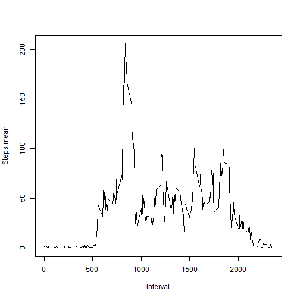
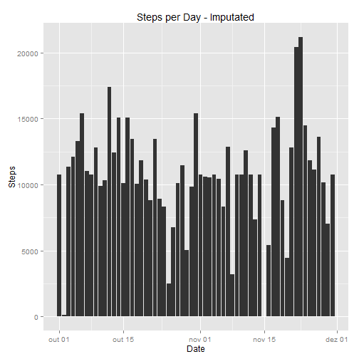

## Introduction

It is now possible to collect a large amount of data about personal movement 
using activity monitoring devices such as a [Fitbit](http://www.fitbit.com), 
[Nike Fuelband](http://www.nike.com/us/en_us/c/nikeplus-fuelband), or
[Jawbone Up](https://jawbone.com/up). These type of devices are part of
the "quantified self" movement -- a group of enthusiasts who take
measurements about themselves regularly to improve their health, to
find patterns in their behavior, or because they are tech geeks. But
these data remain under-utilized both because the raw data are hard to
obtain and there is a lack of statistical methods and software for
processing and interpreting the data.

This assignment makes use of data from a personal activity monitoring device. 
This device collects data at 5 minute intervals through out the day. 
The data consists of two months of data from an anonymous individual collected 
during the months of October and November, 2012 and include the number of steps
taken in 5 minute intervals each day.
    
## Data

The data for this assignment can be downloaded from the course web
site:

* Dataset: [Activity monitoring data](https://d396qusza40orc.cloudfront.net/repdata%2Fdata%2Factivity.zip) [52K]

The variables included in this dataset are:

* **steps**: Number of steps taking in a 5-minute interval (missing
    values are coded as `NA`)

* **date**: The date on which the measurement was taken in YYYY-MM-DD
    format

* **interval**: Identifier for the 5-minute interval in which
    measurement was taken


The dataset is stored in a comma-separated-value (CSV) file and there
are a total of 17,568 observations in this dataset.


## Loading and preprocessing the data

First of all, we need to load the required libraries for this work.


```r
library(knitr)
library(ggplot2)
library(xtable)
library(lattice)
```


I am going to load the activity file now, using the *read.csv* command:


```r
activity <- read.csv("activity.csv")
```

Before processing the data, it might be a good idea to see the internal structure
of the data. As such I will be using *str* command.


```r
str(activity)
```

```
## 'data.frame':	17568 obs. of  3 variables:
##  $ steps   : int  NA NA NA NA NA NA NA NA NA NA ...
##  $ date    : Factor w/ 61 levels "2012-10-01","2012-10-02",..: 1 1 1 1 1 1 1 1 1 1 ...
##  $ interval: int  0 5 10 15 20 25 30 35 40 45 ...
```


As it is possible to see, *date* column is in Factor type. As such, we need to 
convert *date* to Date format:


```r
activity$date <- as.Date(activity$date,"%Y-%m-%d")
str(activity)
```

```
## 'data.frame':	17568 obs. of  3 variables:
##  $ steps   : int  NA NA NA NA NA NA NA NA NA NA ...
##  $ date    : Date, format: "2012-10-01" "2012-10-01" ...
##  $ interval: int  0 5 10 15 20 25 30 35 40 45 ...
```

```r
head(activity)
```

```
##   steps       date interval
## 1    NA 2012-10-01        0
## 2    NA 2012-10-01        5
## 3    NA 2012-10-01       10
## 4    NA 2012-10-01       15
## 5    NA 2012-10-01       20
## 6    NA 2012-10-01       25
```

Now the data is ready to be used to the questions.

## Question One - What is mean total number of steps taken per day?

When we used the command *head* previously, it was possible to notice that days
are not aggregated at all. To fix that, we will use *aggregate* command, in order
to answer the questions.


```r
stepsDay <- aggregate(steps ~ date, data = activity, sum)
```

As requested, we can draw a histogram now, using ggplot system:


```r
ggplot(stepsDay, aes(x = date, y = steps)) + geom_bar(stat = "identity") + 
    ylab("Steps") + xlab("Date") + ggtitle("Steps per Day")
```

 


As it was expected, some intervals are empty, i.e., have NA values. This means that 
in those intervals the individual possibly did not use the device or some malfunction.
Either way, the mean and the median of the data are easily obtained using *mean*
and *median* commands.


```r
meanSteps <- mean(stepsDay$steps)
medianSteps <- median(stepsDay$steps)
```

We can now answer the question:  
Q: What is mean total number of steps taken per day?  
A: Mean is 1.0766 &times; 10<sup>4</sup> whereas median is 10765.

## Question Two - What is the average daily activity pattern?


To answer this question, we will first make a time series plot of the five minute
interval and the average number of steps taken, averaged accross all days.

To do that, we'll use *aggregate* command once again, but using *mean* function:


```r
stepsInterval <- aggregate(steps ~ interval, data = activity, mean)
str(stepsInterval)
```

```
## 'data.frame':	288 obs. of  2 variables:
##  $ interval: int  0 5 10 15 20 25 30 35 40 45 ...
##  $ steps   : num  1.717 0.3396 0.1321 0.1509 0.0755 ...
```

Now we can plot as requested:


```r
plot(stepsInterval$interval, stepsInterval$steps, type = "l", xlab = "Interval", ylab = "Steps mean")
```

 

Using *max* command, we can estimate what interval has the highest steps mean.


```r
maxSteps <- max(stepsInterval$steps)
maxInterval <- stepsInterval[stepsInterval$steps == maxSteps, 1]
```

Now we can answer the question:  
Q: Which 5-minute interval, on average across all the days in the dataset, contains 
the maximum number of steps?  
A: The 5-minute interval that contains the maximum number of steps is the interval 
number 835 with an average of 206.1698 steps.


## Question Three: Imputing missing values

As we verified previously, there are some intervals with NA values. We can 
calculate this amount:


```r
numOfNa <- sum(is.na(activity$steps))
```

There are 2304 NA values through the data.  

Now I was requested to devise a strategy fopr filling in all of the missing values
in the dataset. For that purpose, I decided to fill each NA value with its 
average steps for each interval.

First, we need to create a dataset that is equal to the original dataset,
except that it will be used to fill the missing data:


```r
activityNoNa <- activity
```

The devised strategy can now be applied using both datasets: it will run a cycle
where it will verify if there is a NA Value in the specific row. In case it is
positive, the same row will be filled with the average steps calculated in Question 
Two, for each interval.


```r
for (i in 1:nrow(activityNoNa)) {
    if (is.na(activityNoNa[i, ]$steps)) {
        indInterval <- activityNoNa[i, ]$interval  
        activityNoNa[i, ]$steps <- stepsInterval[stepsInterval$interval == indInterval, ]$steps
    }
}
```

First we need to verify if all NA values disappeared.


```r
numOfNaNoNa <- sum(is.na(activityNoNa$steps))
```

After imputating missing data, there are 0 NA values, as expected.

We can now aggregate the data as previously:


```r
stepsDayNoNa <- aggregate(steps ~ date, data = activityNoNa, sum)
```

Its new histogram will be as follows:


```r
ggplot(stepsDayNoNa, aes(x = date, y = steps)) + geom_bar(stat = "identity") + 
    ylab("Steps") + xlab("Date") + ggtitle("Steps per Day - Imputated")
```

 


We can surely see some gaps (altough less than before). These gaps are composed by
extremely low values or Zero, as we can see as follows:


```r
head(stepsDayNoNa)
```

```
##         date steps
## 1 2012-10-01 10766
## 2 2012-10-02   126
## 3 2012-10-03 11352
## 4 2012-10-04 12116
## 5 2012-10-05 13294
## 6 2012-10-06 15420
```

This is mosly likely due to a malfunction of the device.

Finally calculate the new mean and median of the last histogram:


```r
meanStepsNoNa <- mean(stepsDayNoNa$steps)
medianStepsNoNa <- median(stepsDayNoNa$steps)
```

We can create a table to show old and new values of mean and median:


```r
meanCompare <- matrix(c(meanSteps,medianSteps,meanStepsNoNa,medianStepsNoNa),ncol=2,byrow=TRUE)
colnames(meanCompare) <- c("Mean","Median")
rownames(meanCompare) <- c("With NA Values","Without NA Values")
```


```r
kable(meanCompare, format="html")
```

<table>
 <thead>
  <tr>
   <th align="left">   </th>
   <th align="right"> Mean </th>
   <th align="right"> Median </th>
  </tr>
 </thead>
<tbody>
  <tr>
   <td align="left"> With NA Values </td>
   <td align="right"> 10766 </td>
   <td align="right"> 10765 </td>
  </tr>
  <tr>
   <td align="left"> Without NA Values </td>
   <td align="right"> 10766 </td>
   <td align="right"> 10766 </td>
  </tr>
</tbody>
</table>
  
  
  
The distribution changed a bit when imputating NA Values, i.e., whereas their 
mean remained the same (1.0766 &times; 10<sup>4</sup>), its median increased to the same value
as mean.  


This change happened because of the fact that when data tables have NA values 
and when estimating their median values, R excludes automatically those NA values. 
When we fill the missing data, all values are included to the median estimations 
and hence R is able to estimate a better median value.


## Question Four: Are there differences in activity patterns between weekdays and weekends?

For the last question, we are asked to verify if there are differences in activity
patterns between weekdats and weekends.  

For that purpose, we will be using *weekdays()* function to identify the weekday
from each date and then make a new factor variable where it says that that date 
is a weekday or weekend day.  

Since my RStudio/SO is Portuguese, I had to write the names of the weekends in
portuguese hence the "sábado" and "domingo" words.


```r
day <- weekdays(activityNoNa$date) == "sábado" | weekdays(activityNoNa$date) == "domingo"
activityNoNa$day[day] <- "weekend"
activityNoNa$day[!day] <- "weekday"
activityNoNa$day <- factor(activityNoNa$day)

str(activityNoNa)
```

```
## 'data.frame':	17568 obs. of  4 variables:
##  $ steps   : num  1.717 0.3396 0.1321 0.1509 0.0755 ...
##  $ date    : Date, format: "2012-10-01" "2012-10-01" ...
##  $ interval: int  0 5 10 15 20 25 30 35 40 45 ...
##  $ day     : Factor w/ 2 levels "weekday","weekend": 1 1 1 1 1 1 1 1 1 1 ...
```

Now we need to separate both days - weekend days and weekdays. For that purpose
we will be using aggregate as before, and obtain the average steps in function
of the weekday day.


```r
# separate and calculate mean
weekend <- aggregate(steps ~ interval, data = activityNoNa[activityNoNa$day == "weekend", ], mean)
weekend$day <- "weekend"
weekday <- aggregate(steps ~ interval, data = activityNoNa[activityNoNa$day == "weekday", ], mean)
weekday$day <- "weekday"

#merge data while creating a new factor variable again
stepsTotal <- rbind(weekend,weekday)
stepsTotal$day <- factor(stepsTotal$day)
```

Now we can plot the data in function of the weekday day. For this purpose, we
will be using the *lattice* system. 


```r
xyplot(stepsTotal$steps ~ stepsTotal$interval | stepsTotal$day, type = "l", xlab = "Interval", ylab = "Steps mean", 
    layout = c(1, 2))
```

 


Now we can answer the question:  
Q: Are there differences in activity patterns between weekdays and weekends?  
A: Yes, there are. As it is possible to see, there are some relevant differences 
specially at the intervals between 700 and 900, where I suspect that the individual
may be walking to the work at those times, whereas on the weekend days the 
individual does not walk that much. It is interesting to observe that during the 
weekday, the average steps suddenly increases at around 550 (meaning that the 
individual probably woken up and started the day), whereas during the weekend 
days this increasement is not so obvious, but gradual.
